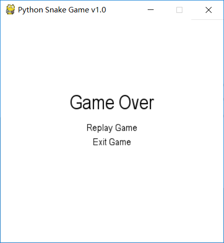
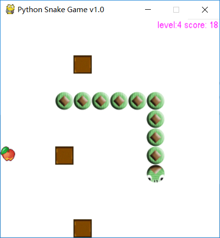

贪吃蛇现在可以说是可以移动，可以生成地图、可以生成食物，现在我们来做一个检测，当蛇吃到的食物时则刷新地图和调整蛇速度

<!-- more -->

## 基础移动以及身体加长

首先做移动检测，当蛇头和食物碰撞时，则判断食物被吃且身体添加一格，先是碰撞检测部分

```python
# 判断是否吃到食物
def has_eat(self, food):
    # 头部与食物相碰撞
    return self._block_is_hit(self.body[0], food)

# 判断坐标是否相等
def _block_is_hit(self, pos1, pos2):
    return pos1[0] == pos2[0] and pos1[1] == pos2[1]
```

然后对蛇身部分进行一次判断

```python
if not self._plus:
    # 剔除最末尾
    self.body.pop(len(self.body) - 1)
else:
    self._plus = False
```

最后将移动与界面联合起来，吃到食物后将随机生成食物位置：

```python
# 蛇移动事件处理
def on_move(self):
    if self.snake.has_eat(self._food):
        self.snake.plus()
        self._food = self._get_random_block()
```

现在，吃到食物能够加长身体了，需要判断蛇头是否撞墙以及撞到身体：

```python
# 判断是否撞到物品
def has_hit(self, blocks):
    bodys = copy.deepcopy(self.body)
    head = bodys.pop(0)
    for block in bodys:
        if self._block_is_hit(head, block):
            return True
    for block in blocks:
        if self._block_is_hit(head, block):
            return True
    return False
```

如果撞到了则切换到游戏结束页面：

```python
# 蛇移动事件处理
def on_move(self):
    if self.snake.has_eat(self._food):
        self.snake.plus()
        self._food = self._get_random_block()
    # 如果碰撞，切换到游戏结束页面
    if self.snake.has_hit(self._block):
        self.context.view = GameOverView(self.context)
```

现在编写游戏结束界面

```python
class GameOverView(View):
    btn_replay = None
    btn_exit = None
    context = None
    game_over = None

    def __init__(self, context):
        self.btn_replay = Button('Replay Game', self._on_start)
        self.btn_exit = Button('Exit Game', self._on_exit)
        font = pygame.font.SysFont('arial', 32)
        self.game_over = font.render('Game Over', True, (0, 0, 0))
        self.context = context

    def on_draw(self):

        s_w, s_h=self.context.screen.get_size()
        l_w, l_h=self.game_over.get_size()
        x, y, bs_w, bs_h=self.btn_replay.get_box()
        x, y, be_w, be_h=self.btn_exit.get_box()

        # 所有元素高度
        y_h = bs_h + be_h + l_h + 4 + 50

        y_start=s_h/2-y_h/2 + 50
        '''
        界面元素排版
        '''
        self.btn_replay.pos=(s_w/2 - bs_w / 2, y_start)
        self.btn_exit.pos=(s_w/2 - be_w / 2, y_start + bs_h + 4)
        self.context.screen.blit(self.game_over, (s_w/2-l_w/2, s_h/2-y_h/2))
        # 绘制按钮
        self.btn_replay.on_draw(self.context.screen)
        self.btn_exit.on_draw(self.context.screen)
    
    def _on_exit(self):
        # 控制退出状态
        print('exit game')
        self.context.running=False

    def _on_start(self):
        # 切换界面到游戏界面
        print('start game')
        self.context.view=GameView(self.context)
 
    def on_event(self, event):
        # 监控各种事件
        self.btn_replay.on_event(event)
        self.btn_exit.on_event(event)
```

界面：




## 游戏关卡级别

当吃到食物后，计算吃到的次数，如果吃到的次数和关卡一致，则速度增加

```python
def on_move(self):
    if self.snake.has_eat(self._food):
        self.snake.plus()
        self._food = self._get_random_block()
        # 积分加一
        self.score = self.score + self.level
        # 等级调整
        self.eat_count = self.eat_count + 1
        if self.eat_count >= self.level:
            # 游戏难度+1
            self.level = self.level + 1
            # 移动速度+1
            self.snake.speed = self.snake.speed - 1
            # 食物计算归零
            self.eat_count = 0
            # 重新生成地图
            self._block = [self._get_random_block() for i in range(random.randrange(3, 6))]
```


显示积分：

```python
text = self.font.render('level:%d score: %s' % (
    self.level, self.score), True, (0xff, 0, 0xff))
self.context.screen.blit(
    text, (self.context.screen.get_size()[0] - text.get_size()[0] - 2, 0))
```


运行界面：



程序代码：https://github.com/DXkite/python-snake-game-demo/tree/master/10-snake-level