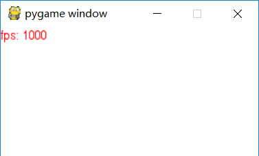
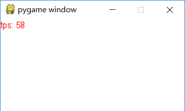

在一个游戏中，显示的控制也是一个比较重要的东西，在不同的机器上，界面刷新的频率不一样（也就是fps不一样），这样照成的结果就是
在不同情况下，基于帧的动画的效果会不同，本次将控制帧率

<!-- more -->

## 显示帧率

一般来说，pygame提供了一个控制帧率的方法，但是在低端机会照成帧率跟不上的情况，我们先显示一下帧率

```python
import pygame 
from pygame import QUIT

# 1. 先初始化游戏框架
pygame.init()
# 2. 创建一个窗口
screen = pygame.display.set_mode((300,150),0,32)
# 加载字体 (使用系统字体)
font = pygame.font.SysFont('arial', 16)
# 运行标志
running = True
# 案件方向
mouse  = (0,0)
mouse_move = (0,0)
mouse_key = None
text = 'fps: %s'
fps = 0
FPS_MAX = 60

clock = pygame.time.Clock()

# 1. 游戏死循环
while running:
    # 2. 获取事件流
    for event in pygame.event.get():
        # 3. 处理事件流
        if event.type == QUIT:
            # 结束运行
            running = False

    # 2.1 屏幕填充白色
    screen.fill((0xff,0xff,0xff))
    # 2.3 渲染文字
    text_surface = font.render(text % fps ,True,(0xff,0,0))
    # 2.4 贴图文字
    screen.blit(text_surface,(0,0))
    # 3. 刷新显示窗口
    pygame.display.flip() 
    passed_time = clock.tick() 
    print(passed_time)
    if passed_time <=0 :
        passed_time = 1
    fps =  int(1/passed_time*1000)

# 4. 退出框架
pygame.quit()
```
*帧率*



因为我们没有进行什么比较消耗时间的操作，帧率非常快，1秒钟刷新了1000次左右，现在我们来限制帧率

## 使用 tick 限制帧率

在pygame中，tick方法可以限制最高帧率 (Frame Per Second)

```python
import pygame 
from pygame import QUIT

# 1. 先初始化游戏框架
pygame.init()
# 2. 创建一个窗口
screen = pygame.display.set_mode((300,150),0,32)
# 加载字体 (使用系统字体)
font = pygame.font.SysFont('arial', 16)
# 运行标志
running = True
# 案件方向
mouse  = (0,0)
mouse_move = (0,0)
mouse_key = None
text = 'fps: %s'
fps = 0
FPS_MAX = 60

clock = pygame.time.Clock()

def get_fps(passed_time):
    if passed_time <=0 :
        passed_time = 1
    return int(1/passed_time*1000)
# 1. 游戏死循环
while running:
    # 2. 获取事件流
    for event in pygame.event.get():
        # 3. 处理事件流
        if event.type == QUIT:
            # 结束运行
            running = False

    # 2.1 屏幕填充白色
    screen.fill((0xff,0xff,0xff))
    # 2.3 渲染文字
    text_surface = font.render(text % fps ,True,(0xff,0,0))
    # 2.4 贴图文字
    screen.blit(text_surface,(0,0))
    # 3. 刷新显示窗口
    pygame.display.flip() 
    ## 限制最高帧率
    passed_time = clock.tick(FPS_MAX) 
    fps = get_fps(passed_time)

# 4. 退出框架
pygame.quit()
```



## 手动限制帧率

如果没有 tick 方法的话，我们可以通过计算时间来限制帧率

```python
import pygame 
from pygame import QUIT

# 1. 先初始化游戏框架
pygame.init()
# 2. 创建一个窗口
screen = pygame.display.set_mode((300,150),0,32)
# 加载字体 (使用系统字体)
font = pygame.font.SysFont('arial', 16)
# 运行标志
running = True
# 案件方向
mouse  = (0,0)
mouse_move = (0,0)
mouse_key = None
text = 'fps: %s'
fps = 0
FPS_MAX = 60
fps_time = 1000/FPS_MAX;

clock = pygame.time.Clock()

def get_fps(passed_time):
    if passed_time <=0 :
        passed_time = 1
    return int(1/passed_time*1000)
# 1. 游戏死循环
while running:
    start_time = pygame.time.get_ticks()
    # 2. 获取事件流
    for event in pygame.event.get():
        # 3. 处理事件流
        if event.type == QUIT:
            # 结束运行
            running = False

    # 2.1 屏幕填充白色
    screen.fill((0xff,0xff,0xff))
    # 2.3 渲染文字
    text_surface = font.render(text % fps ,True,(0xff,0,0))
    # 2.4 贴图文字
    screen.blit(text_surface,(0,0))
    # 3. 刷新显示窗口
    pygame.display.flip() 
    ## 限制最高帧率
    passed_time = pygame.time.get_ticks() - start_time
    if  fps_time > passed_time:
        pygame.time.wait(int(fps_time - passed_time))
    passed_time = pygame.time.get_ticks() - start_time
    fps = get_fps(passed_time)

# 4. 退出框架
pygame.quit()
```

