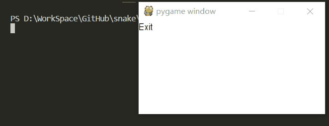

为了实现游戏中部分控制的操作，现在我们现在自定义一个按钮控件，功能也不多，定位采用绝对定位，鼠标点击之后就调用回调函数，并有个按下效果。

<!-- more -->

按钮的UI采用文字，或者其他自定义的表面都可，基本框架代码如下：

```python
import pygame
"""
Button 控件
-----------
为pygame 绘制一个button
"""


class Button:
    x = 0
    y = 0
    font = pygame.font.SysFont('arial', 16)
    click = None
    surface_normal = None
    surface_hover = None
    surface_clicked = None
    text = 'Button'

    def __init__(self, text, callable):
        self.click = callable
        self.text = text


    """
    绘制按钮
    """

    def on_draw(self, screen):
        pass

    """
    监控事件
    """

    def on_event(self, event):
        pass
```

一个按钮在运行中会监控鼠标按下事件，当鼠标移动到按钮上面的时候会显示 `surface_hover` ，正常状况下显示为 `surface_normal` ，当鼠标按下时显示 `surface_click` ，按下之后调用回调函数 `click`，这就是整个按钮的功能

## 生成显示区域

为了区分状态，这里我们生成三个表面来控制显示UI，并监控三种状态，代码如下：

```python
import pygame
from pygame import MOUSEBUTTONDOWN, MOUSEBUTTONUP, MOUSEMOTION

pygame.init()


"""
Button 控件
-----------
为pygame 绘制一个button
"""


class Button:
    NORMAL = 0
    CLICKED = 1
    HOVER = 2

    pos = (0, 0)
    font = pygame.font.SysFont('arial', 16)
    click = None
    surface_normal = None
    surface_hover = None
    surface_clicked = None
    status = NORMAL
    text = 'Button'
    
    def __init__(self, text, callable):
        self.click = callable
        self.text = text
        self._gen_surface()

    """
    绘制按钮
    """

    def on_draw(self, screen):
        if self.status == Button.HOVER:
            screen.blit(self.surface_hover, self.pos)
        elif self.status ==  Button.CLICKED:
            screen.blit(self.surface_clicked, self.pos)
        else:
            screen.blit(self.surface_normal, self.pos)

    """
    监控事件
    """

    def on_event(self, event):
        if event.type == MOUSEBUTTONDOWN:
            pass
        elif event.type == MOUSEBUTTONUP:
            pass
        elif event.type == MOUSEMOTION:
            pass

    def _gen_surface(self):
        self.surface_normal = self.font.render(self.text, True, (0, 0, 0))
        self.surface_hover = self.font.render(self.text, True, (0, 0, 0),
                                              (0xee, 0xee, 0xee))
        self.surface_clicked = self.font.render(self.text, True, (0, 0, 0),
                                                (0x22, 0x22, 0x22))
```

### 监控鼠标事件

按钮绘制好了之后，我们需要检测鼠标状态来控制按钮显示的位置以及调用回调按下事件的回调函数，既判断按钮所在区域
判断点是否在矩形内：
```python
def _in_button_box(self, point, box):
    p_x, p_y = point
    x, y, w, h = box
    if p_x >= x and p_x <= x + w:
        if p_y >= y and p_y <= y + h:
            return True
    return False
```

控制按键显示以及回调：

```python
def on_event(self, event):
    if event.type == MOUSEBUTTONDOWN:
        if self._in_button_box(event.pos, self.box):
            self.status = self.CLICKED
            self.click()
    elif event.type == MOUSEMOTION:
        if self._in_button_box(event.pos, self.box):
            self.status = self.HOVER
        else:
            self.status = self.NORMAL
    else:
        self.status = self.NORMAL
```

*运行测试*




全部代码

> main.py

```python
import pygame
from pygame import QUIT

from pygameui import Button

# 1. 先初始化游戏框架
pygame.init()
# 2. 创建一个窗口
screen = pygame.display.set_mode((300, 150), 0, 32)
# 加载字体 (使用系统字体)
font = pygame.font.SysFont('arial', 16)
# 运行标志
running = True

text = 'Play music with any keydown'

clock = pygame.time.Clock()
'''
初始化音频播放器
'''
# 初始化
pygame.mixer.init()


def click_test():
    print('button clicked')


button = Button(text='Exit', callable=click_test)

# 1. 游戏死循环
while running:
    # 2. 获取事件流
    for event in pygame.event.get():
        button.on_event(event)
        # 3. 处理事件流
        if event.type == QUIT:
            # 结束运行
            running = False
    screen.fill((0xff, 0xff, 0xff))
    button.on_draw(screen)
    # 3. 刷新显示窗口
    pygame.display.flip()
    clock.tick(60)

# 4. 退出框架
pygame.quit()

```

> pygameui.py

```python
import pygame
from pygame import MOUSEBUTTONDOWN, MOUSEMOTION
from pygame import Rect

pygame.init()
"""
Button 控件
-----------
为pygame 绘制一个button
"""


class Button:
    NORMAL = 0
    CLICKED = 1
    HOVER = 2

    pos = (0, 0)
    font = pygame.font.SysFont('arial', 16)
    click = None
    surface_normal = None
    surface_hover = None
    surface_clicked = None
    status = NORMAL
    text = 'Button'
    box = None

    def __init__(self, text, callable):
        self.click = callable
        self.text = text
        self._gen_surface()
        self.box = Rect(self.pos, self.surface_normal.get_size())

    """
    绘制按钮
    """

    def on_draw(self, screen):
        if self.status == Button.HOVER:
            screen.blit(self.surface_hover, self.pos)
        elif self.status == Button.CLICKED:
            screen.blit(self.surface_clicked, self.pos)
        else:
            screen.blit(self.surface_normal, self.pos)

    """
    监控事件
    """

    def on_event(self, event):
        if event.type == MOUSEBUTTONDOWN:
            if self._in_button_box(event.pos, self.box):
                self.status = self.CLICKED
                self.click()
        elif event.type == MOUSEMOTION:
            if self._in_button_box(event.pos, self.box):
                self.status = self.HOVER
            else:
                self.status = self.NORMAL
        else:
            self.status = self.NORMAL

    def _gen_surface(self):
        self.surface_normal = self.font.render(self.text, True, (0, 0, 0))
        self.surface_hover = self.font.render(self.text, True, (0, 0, 0),
                                              (0xee, 0xee, 0xee))
        self.surface_clicked = self.font.render(self.text, True, (0, 0, 0),
                                                (0x22, 0x22, 0x22))

    def _in_button_box(self, point, box):
        p_x, p_y = point
        x, y, w, h = box
        if p_x >= x and p_x <= x + w:
            if p_y >= y and p_y <= y + h:
                return True
        return False

```