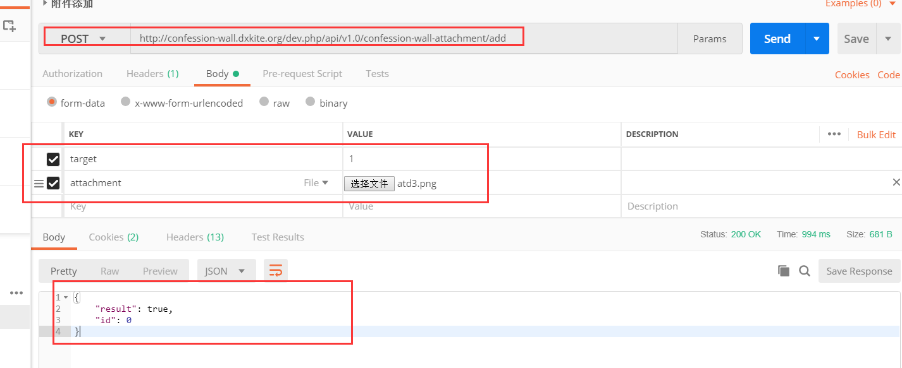

一个表白墙的功能原本上是不需要附件的功能的，但是在markdown里面的图片和资源也可以算作附件。

<!-- more -->

为了能够通用化，还是对表段进行了一次通用的处理，在此之前还得更新下框架，刚刚调整了解析表达式的功能。

## 通用的表

这里我们创建一个表，接受一个 `Command` 表达式描述的类作为参数，通过方法 `Command::newClassInstance` 实例化一个类描述。

类描述的一般形式 `"name.space.for.ClassName"` 还可以带简单参数：`"name.space.for.ClassName(params)"`

现在我们创建一个表：

```php
<?php
namespace dxkite\attachments\table;

use suda\tool\Command;
use suda\archive\Table;

/**
 * 附件表
 */
class AttachmentTable extends Table
{
    protected $target;

    public function __construct(string $target=null)
    {
        // 实例化一个字符串到类
        $this->target = Command::newClassInstance($target);
        $perfix = self::parsePerfix($this->target->getTableName());
        parent::__construct($perfix.'attachments');
    }

    public function getTargetTable():Table
    {
        return $this->target;
    }

    protected function parsePerfix(?string $fix)
    {
        if (!is_null($fix)) {
            $fix = $fix.'_';
            return ltrim(preg_replace('/[^\w]+/', '_', $fix), '_');
        }
        return '';
    }

    public function onBuildCreator($table)
    {
        return $table->fields(
            $table->field('id', 'bigint', 20)->primary()->unsigned()->auto(),
            $table->field('target', 'bigint', 20)->unsigned()->comment('目标内容'),
            $table->field('attachment', 'bigint', 20)->unsigned()->comment('附件ID'),
            $table->field('hash', 'varchar', 32)->comment('附件Hash'),
            $table->field('time', 'int', 11)->key()->unsigned()->comment('添加时间')
        );
    }
}
```

## 控制器

这里提供了三个功能，对附件的添加删除和修改，其中添加的话只能当前用户添加到自己的表白（target）里面去，
这里还使用了一个类 `dxkite\support\file\Media` 用于将文件类 `dxkite\support\file\File` 存储到数据库中。
文件类的话这里是由Support模块维护，可以接受一个Form表单提供的文件。

```php
<?php
namespace dxkite\attachments\controller;

use suda\core\Query;
use suda\exception\SQLException;
use dxkite\support\file\File;
use dxkite\support\file\Media;
use dxkite\attachments\table\AttachmentTable;

/**
 * 附件控制器
 */
class AttachmentController
{
    protected $table;
    protected $target;
    protected $userField;

    public function __construct(string $target, string $userField = 'user')
    {
        
        $this->table=new AttachmentTable($target);
        $this->target = $this->table->getTargetTable();
        $this->userField = $userField;
    }

    public function add(int $target, File $attachment):bool
    {
        if ($targetData = $this->target->getByPrimaryKey($target)) {
            if ($targetData[$this->userField] == get_user_id()) {
                if ($this->table->select('*', ['hash'=>$attachment->getMd5(),'target'=>$target])->fetch()) {
                    return true;
                } else {
                    $file = Media::save($attachment);
                    if (!$file) {
                        return false;
                    }
                    return $this->table->insert([
                        'time'=>time(),
                        'target'=> $target,
                        'attachment' => $file->getId(),
                        'hash' => $attachment->getMd5(),
                    ]) > 0;
                }
            } else {
                return false;
            }
        }
    }

    public function getAttachments(int $target):?array
    {
        if ($images = $this->table->select('*', ['target'=>$target])->fetchAll()) {
            return $images;
        }
        return null;
    }

    public function delete(int $attachmentId):bool
    {
        if ($fetchData = $this->table->select(['attachment','target'], ['id'=>$attachmentId])->fetch()) {
            list('target'=>$target,'attachment' => $attachment) = $fetchData;
            if ($targetData = $this->target->getByPrimaryKey($target)) {
                if ($targetData[$this->userField] == get_user_id()) {
                    Media::delete($attachment);
                    return $this->table->delete(['id'=>$attachmentId]) > 0;
                } else {
                    return false;
                }
            }
        }
        return false;
    }
}
```

## Provider 的实现

由于没有什么东西，就暂时先把 `Controller` 映射出去

```php
<?php
namespace dxkite\attachments\provider;

use dxkite\attachments\controller\AttachmentController;
use dxkite\support\file\File;

/**
 * 附件
 */
class AttachmentProvider
{
    protected $controller;

    public function __construct(string $name = null)
    {
        $this->controller =  new AttachmentController($name);
    }
    
    public function add(int $target, File $attachment):bool
    {
        return $this->controller->add($target, $attachment);
    }

    public function getAttachments(int $target):?array
    {
        return $this->controller->getAttachments($target);
    }

    public function delete(int $attachmentId):bool
    {
        return $this->controller->delete($attachmentId);
    }
}
```

## 添加到表白墙模块

只需要在表白墙的API映射表中添加，注意这里参数是一个表类的字符表示，而不是上面的一个单纯的字符串了：

```yml
v1.0:
  confession-wall: dxkite.confession.wall.provider.ConfessionProvider
  confession-wall-comment: dxkite.comments.provider.CommentProvider(confession-wall)
  confession-wall-attachment: dxkite.attachments.provider.AttachmentProvider(dxkite.confession.wall.table.ConfessionTable)
  confession-wall-setting: dxkite.confession.wall.provider.ConfessionSettingProvider
```

## 测试

由于我们的`add` 方法中包含了文件, 所以不能用简单的json来传输,现在采用Form表提交:


 
为了保证数据的准确，用Form提交的时候必须要有参数名，这个参数名和函数声明的地方的参数名保持一致，而不是之前使用JSON的时候采用忽略参数名的形式提交了。


## 作业

- 复现
- 将评论模块的复用实现方式改成附件的实现方式
- **评论模块有逻辑BUG，请找出并改正**