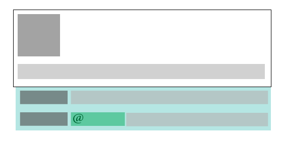

这里我们写一个评论功能，对其的要求也不高，添加这个模块后，我们不管是表白墙还是文章模块都要可以用，使用也要很简单。为了实现这个功能，我从框架层面升级了一波，基础模块也变更了部分。

- [Support](suda-comment/dxkite-support.8.27.mod)
- 更新框架

<!-- more -->

## 评论设计

我们要实现的评论格式显示好之后大概如下



功能要求：

1. 评论目标
2. 回复回复（回复下面的评论）
3. 回复回复的回复（@某人并回复）


## 表设计

因为一个网站的功能里，可能回复的数量是最多的，这里我们分两个表（其实一个表也可以做到）

```php
<?php
namespace dxkite\comments\table;

/**
 * 评论
 */
class CommentTable extends \suda\archive\Table
{
    const CONTENT_TYPE = 'markdown';

    const STATUS_DELETE = 0;  // 删除状态
    const STATUS_NORMAL = 1;  // 正常状态
    const STATUS_DRAFT = 2;  // 草稿状态

    public function __construct(string $subfix=null)
    {
        parent::__construct('comment'. self::parseSubfix($subfix));
    }
    
    protected function parseSubfix(?string $subfix) {
        if (!is_null($subfix)) {
            $subfix = '_'.$subfix;
            return preg_replace('/[^\w]+/','_',$subfix);
        }
        return '';
    }

    public function onBuildCreator($table)
    {
        return $table->fields(
            $table->field('id', 'bigint', 20)->primary()->unsigned()->auto(),
            $table->field('user', 'bigint', 20)->key()->comment('发布者'),
            $table->field('target', 'bigint', 20)->key()->comment('目标'),
            $table->field('content', 'text')->comment("文字内容"),
            $table->field('time', 'int', 11)->key()->unsigned()->comment('发表时间'),
            $table->field('ip', 'varchar', 32)->comment('发布IP'),
            $table->field('status', 'int', 11)->key()->unsigned()->default(self::STATUS_DRAFT)->comment('状态')
        );
    }
    
    /**
     * 使用Markdown 对内容进行默认编码
     *
     * @param string $content
     * @return void
     */
    protected function _inputContentField(string $content)
    {
        return content_pack($content, self::CONTENT_TYPE);
    }

    /**
     * 将内容解码成HTML格式
     *
     * @param string $content
     * @return void
     */
    protected function _outputContentField(string $content)
    {
        // 解码成对象
        if ($object = content_unpack($content)) {
            return $object;
        }
        // 未设置解码则按text编码
        return content_create($content, 'text');
    }
}
```

这里为了实现复用的功能，我们在构造函数中给表名加了个后缀（subfix），这个表的功能就是存储评论（1）、现在我们来存储评论的评论、评论的回复。

```php
<?php
namespace dxkite\comments\table;

/**
 * 子评论
 */
class SubCommentTable extends CommentTable
{
    public function __construct(string $subfix =null)
    {
        parent::__construct('sub' .self::parseSubfix($subfix));
    }

    public function onBuildCreator($table)
    {
        $table = parent::onBuildCreator($table);
        return $table->fields(
            $table->field('parent', 'bigint', 20)->key()->comment('父评论'),
            $table->field('reply', 'bigint', 20)->key()->comment('回复')
        );
    }
}
```

因为表结构相似，我们这里继承扩展一下就可以了，加了两个表段，表示回复了谁，回复的是那个评论。

## 分模块

在实现之前我们还需把他放到一个独立的模块去（毕竟功能要用的多，当然是独立出来）

## 基本功能实现

功能实现非常简单，也就是对评论的 `CUDR`，但是这里要注意的是，Controller和Provider的构造函数都含参数。

### dxkite\comments\controller\CommentController

控制器实现：

```php
<?php
namespace dxkite\comments\controller;

use dxkite\comments\table\CommentTable;
use dxkite\comments\table\SubCommentTable;
use dxkite\support\view\TablePager;

/**
 * 评论
 */
class CommentController
{
    protected $commentTable;
    protected $subCommentTable;

    public function __construct(string $name = null)
    {
        $this->commentTable= new CommentTable($name);
        $this->subCommentTable= new SubCommentTable($name);
    }

    /**
     * 评论
     *
     * @param integer $target
     * @param string $content
     * @return integer
     */
    public function add(int $target, string $content):int
    {
        $user =  get_user_id();
        return $this->commentTable->insert([
            'user' => $user,
            'target' => $target,
            'content' => $content,
            'time' => time(),
            'ip' => request()->ip(),
            'status' =>  CommentTable::STATUS_NORMAL,
        ]);
    }

    /**
     * 评论评论
     *
     * @param integer $comment
     * @param string $content
     * @return integer
     */
    public function comment(int $comment, string $content):int
    {
        $user =  get_user_id();
        if ($parent = $this->commentTable->getByPrimaryKey($comment)) {
            return $this->subCommentTable->insert([
                'user' => $user,
                'target' => $parent['target'],
                'content' => $content,
                'parent'=> $comment,
                'time' => time(),
                'ip' => request()->ip(),
                'status' =>  CommentTable::STATUS_NORMAL,
            ]);
        }
        return 0;
    }

    /**
     * 删除评论
     *
     * @param integer $comment
     * @param boolean $sub
     * @return boolean
     */
    public function delete(int $comment, bool $sub = false):bool
    {
        $user =  get_user_id();
        $table = $sub ? $this->subCommentTable : $this->commentTable;
        if ($that = $table->getByPrimaryKey($comment)) {
            // 只有自己能够删除
            if ($that['user'] == $user) {
                return $table->updateByPrimaryKey($that['id'], [
                    'status' =>  CommentTable::STATUS_DELETE,
                ]) > 0;
            }
        }
    }

    /**
     * 回复子评论
     *
     * @param integer $subcommet
     * @param string $content
     * @return integer
     */
    public function reply(int $subcommet, string $content):int
    {
        $user =  get_user_id();
        if ($parent = $this->subCommentTable->getByPrimaryKey($subcommet)) {
            return $this->subCommentTable->insert([
                'user' => $user,
                'target' => $parent['target'],
                'reply' => $parent['user'],
                'content' => $content,
                'parent'=> $parent['parent'],
                'time' => time(),
                'ip' => request()->ip(),
                'status' =>  CommentTable::STATUS_NORMAL,
            ]);
        }
        return 0;
    }

    /**
     * 获取目标评论
     *
     * @param integer $target
     * @param integer|null $page
     * @param integer $row
     * @return array|null
     */
    public function getComment(int $target, ?int $page, int $row = 10):?array
    {
        return TablePager::listWhere($this->commentTable, ['status' => CommentTable::STATUS_NORMAL], [], $page, $row);
    }

    /**
     * 获取评论的评论
     *
     * @param integer $comment
     * @param integer|null $page
     * @param integer $row
     * @return array|null
     */
    public function getSubComment(int $comment, ?int $page, int $row = 10):?array
    {
        return TablePager::listWhere($this->subCommentTable, ['status' => CommentTable::STATUS_NORMAL], [], $page, $row);
    }
}
```

### dxkite\comments\provider\CommentProvider

提供者实现：

```php
<?php
namespace dxkite\comments\provider;

use dxkite\comments\controller\CommentController;

/**
 * 评论
 */
class CommentProvider
{
    protected $name = '';
    protected $commentTable;
    protected $subCommentTable;

    public function __construct(string $name = null)
    {
        $this->controller =  new CommentController($name);
    }

    /**
     * 评论
     *
     * @param integer $target
     * @param string $content
     * @return integer
     */
    public function add(int $target, string $content):int
    {
        return $this->controller->add($target, $content);
    }

    /**
     * 评论评论
     *
     * @param integer $comment
     * @param string $content
     * @return integer
     */
    public function comment(int $comment, string $content):int
    {
        return $this->controller->comment($comment, $content);
    }

    /**
     * 回复子评论
     *
     * @param integer $subcommet
     * @param string $content
     * @return integer
     */
    public function reply(int $subcommet, string $content):int
    {
        return $this->controller->reply($subcommet, $content);
    }

    /**
     * 获取目标评论
     *
     * @param integer $target
     * @param integer|null $page
     * @param integer $row
     * @return array|null
     */
    public function getComment(int $target, ?int $page=null, int $row=10):?array
    {
        $comments = $this->controller->getComment($target, $page, $row);
        $rows = $comments['rows'];
        $ids = [];
        foreach ($rows as $index => $row) {
            $ids[] = $row['user'];
            unset($row['ip']);
            $rows[$index] = $row;
        }
        $userInfos = get_user_public_info_array($ids);
        foreach ($rows as $index => $row) {
           $rows[$index]['user'] = $userInfos[$row['user']] ?? $row['user'];
        }
        $comments['rows'] = $rows;
        return $comments;
    }

    /**
     * 获取评论的评论
     *
     * @param integer $comment
     * @param integer|null $page
     * @param integer $row
     * @return array|null
     */
    public function getSubComment(int $comment, ?int $page=null, int $row=10):?array
    {
        $comments = $this->controller->getSubComment($comment, $page, $row);
        $rows = $comments['rows'];
        $ids = [];
        foreach ($rows as $index => $row) {
            $ids[] = $row['user'];
            unset($row['ip']);
            $rows[$index] = $row;
        }
        $userInfos = get_user_public_info_array($ids);
        foreach ($rows as $index => $row) {
            $rows[$index]['user'] = $userInfos[$row['user']] ?? $row['user'];
            $rows[$index]['reply'] = $userInfos[$row['reply']] ?? $row['reply'];
         }
        $comments['rows'] = $rows;
        return $comments;
    }

    /**
     * 删除特定评论
     *
     * @param integer $comment
     * @param boolean $sub
     * @return boolean
     */
    public function delete(int $comment, bool $sub = false):bool
    {
        return $this->controller->delete($comment, $sub);
    }
}
```

现在模块的状态结构如下：


## 在模块中引用

我们在模块的 `api/mapper` 类中引用的是Provider，现在我们的构造函数带了参数，怎么调用？

**confession-wall 模块调用**

```yml
v1.0:
  confession-wall: dxkite.confession.wall.provider.ConfessionProvider
  confession-wall-comment: dxkite.comments.provider.CommentProvider(confession-wall)
  confession-wall-setting: dxkite.confession.wall.provider.ConfessionSettingProvider
```

按照正常思路给他参数就行（不用引号，所有输入参数以`,`分割）。如果参数比较奇怪（包含`)`或者`,`），还支持使用json提交参数数组，不过需要一次base64编码：

`dxkite.comments.provider.CommentProvider(=json::WzEsIjIiXQ)`

先在我们看看我们的API开放接口：


我们可以正常使用这个API，以后其他模块需要这个评论接口，就看可以加一行配置，换一下表后缀就可以了（**注意激活模块**）

## 作业

- 创建好模块 [下载](suda-comment/dxkite-comments.8.27.mod)
- 在表白墙中引用
