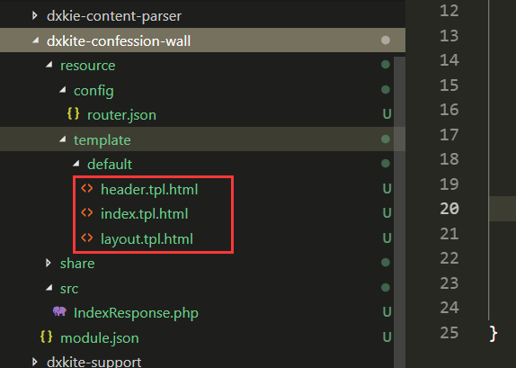
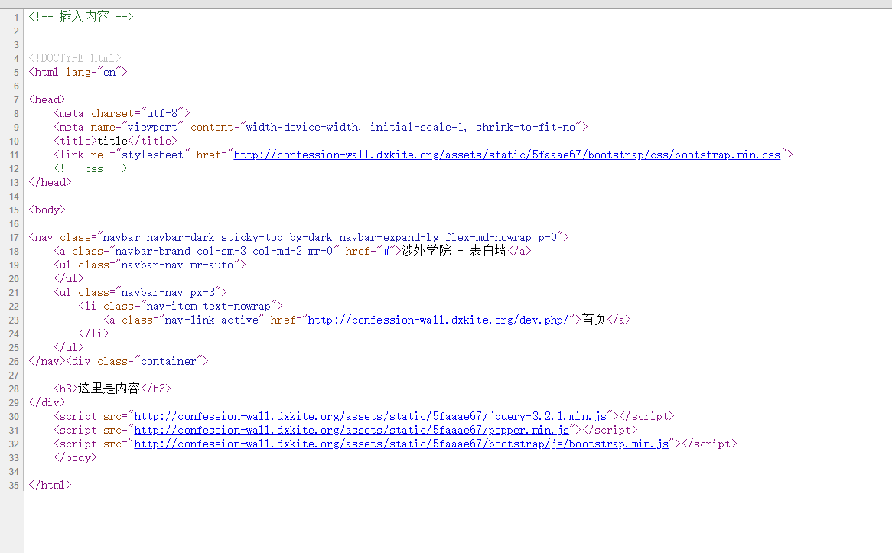
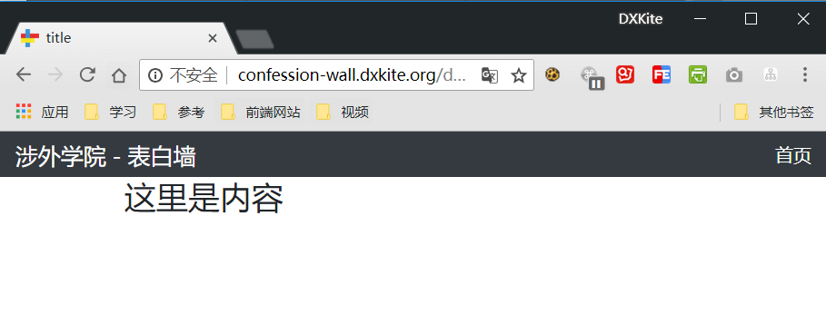

表白墙首要的功能就是表白功能，首先我们来看看表白功能需要存储那些字段？

<!-- more -->

## 数据字段处理

在表白墙中，我们的核心数据字段主要有如下字段：

- 发送用户
- 是否匿名
- 标题
- 内容
- 时间
- IP
- 状态

根据网络安全法的最新规定，我习惯性开发的时候记录操作的IP和时间，所有的数据基本上不会真的被删除，而是标记为一个删除状态。

在这里，我们的内容模块引用了 `dxkite-content-parser` 模块，这个模块提供了一个比较常用的功能：将输入转码存储，用的时候解码成HTML显示，主要提供了如下函数：

- content_create(string $content, string $type='text'):Content
    
    将字符串创建为内容包
- content_pack($content, string $type='text'):string

    将内容包转换为数据库可用的字符串
- content_unpack(string $data):?Content

    将数据库的字符串解包为内容
- content_ispack(string $data)
    
    判断字符串是不是内容包
- content_unpack2html($data):?string

    解包输出成HTML
- content_unpack2raw($data):?string

    解包输出原始内容
- html_content(string $content, string $type = 'text'):string
    
    将内容直接输出HTML

我们使用以上函数即可将内容转换为我们想要的内容，并且包还提供了安全处理，现在我们来创建我们的数据表

```php
<?php
namespace dxkite\confession\wall\table;

/**
 * 表对象，处理表白
 */
class ConfessionTable extends \suda\archive\Table
{
    const CONTENT_TYPE = 'markdown';

    const STATUS_DELETE = 0;  // 删除状态
    const STATUS_NORMAL = 1;  // 正常状态
    const STATUS_DRAFT = -1;  // 草稿状态
    const ANONYMOUS = 1;

    public function __construct()
    {
        parent::__construct('confession');
    }
    
    public function onBuildCreator($table)
    {
        return $table->fields(
            $table->field('id', 'bigint', 20)->primary()->unsigned()->auto(),
            $table->field('user', 'bigint', 20)->key()->comment('发布者'),
            $table->field('anonymous', 'tinyint', 1)->default(self::ANONYMOUS)->comment('匿名发布'),
            $table->field('title', 'varchar', 255)->comment('标题'),
            $table->field('content', 'text')->comment("文字内容"),
            $table->field('time', 'int', 11)->key()->unsigned()->comment('发表时间'),
            $table->field('ip', 'varchar', 32)->comment('发布IP'),
            $table->field('status', 'int', 11)->key()->unsigned()->default(self::STATUS_DRAFT)->comment('状态')
        );
    }
    
    /**
     * 使用Markdown 对内容进行默认编码
     *
     * @param string $content
     * @return void
     */
    protected function _inputContentField(string $content)
    {
        return content_pack($content, self::CONTENT_TYPE);
    }

    /**
     * 将内容解码成HTML格式
     *
     * @param string $content
     * @return void
     */
    protected function _outputContentField(string $content)
    {
        // 解码成对象
        if ($object = content_unpack($content)) {
            return $object;
        }
        // 未设置解码则按text编码
        return content_create($content, 'text');
    }
}
```

如上便是我们的数据表结构，本次我们开发准寻一个套路：Table 负责存储、Controller负责数据处理、Provider负责API化显示，开发的时候我们采用 `Postman` 用来做API的调试

```
Table->Controller->Provider
```

## 创建简单内容发布页面

这个内容发布页面有几个元素，由于本次项目将直接上线，测试的模板采用 `Bootstrap` 来构建一个简单的页面。

添加一个页面 `/`，继承来自`support`库的响应 `dxkite\support\visitor\response\Response`，该响应处理基本的请求：

```php
<?php
namespace dxkite\confession\wall\response;

use dxkite\support\visitor\response\Response;
use dxkite\support\visitor\Context;


class IndexResponse extends Response
{
    public function onVisit(Context $context)
    {
        $view = $this->view('index');
        $view->render();
    }
}

```
### 基础套版

因为页面很多地方都似乎是共同的，我先弄一个页面套版：

#### header.tpl.html 导航栏部分
这里直接是HTML代码，还有一些引入部分的变量，以及判断页面，
`@b(表达式，成功，失败)` 语法类似三元操作符，然后 `$this->isMe` 用于判断当前的路由是否为指定的路由，这里判断是否为 `index` 路由。
```html
<nav class="navbar navbar-dark sticky-top bg-dark navbar-expand-lg flex-md-nowrap p-0">
    <a class="navbar-brand col-sm-3 col-md-2 mr-0" href="#">{{ $:website_name('涉外学院 - 表白墙') }}</a>
    <ul class="navbar-nav mr-auto">
    </ul>
    <ul class="navbar-nav px-3">
        <li class="nav-item text-nowrap">
            <a class="nav-link @b($this->isMe('index'),'active')" href="@u('index')">首页</a>
        </li>
    </ul>
</nav>
```

#### layout.tpl.html 布局控制部分

`@extend` 继承来自support模块的bootstrap模板。
`@startInsert ... @endInsert` 用于往继承的模板中的 `@insert` 点插入代码。
这里预留了一个插入点 `confession-content` 用于插入内容。

```html
@extend ('support:bootstrap') 
@startInsert('bs-head')
<!-- css -->
@endInsert 
@startInsert('bs-content') 
@include ('header')
<div class="container">
    @if ($?:alert)
    <div class="alert alert-{{ $:alert.type }} m-2" role="alert"> {{ $:alert.text }}
        <button type="button" class="close" data-dismiss="alert" aria-label="Close">
            <span aria-hidden="true">&times;</span>
        </button>
    </div>
    @endif 
    @insert('confession-content')
</div>
@endInsert
```

#### index.tpl.html

在主页面，继承`layout`，并在 `confession-content` 插入点插入内容。
```html
@extend ('layout')
<!-- 插入内容 -->
@startInsert('confession-content')
<h3>这里是内容</h3>
@endInsert

```


所有布局文件完善后：



运行效果



显示：

