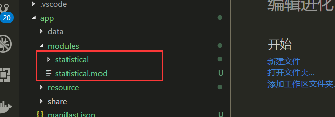
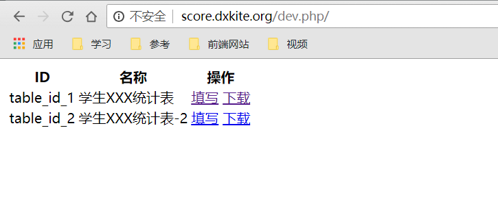
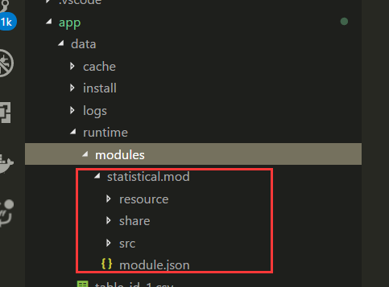
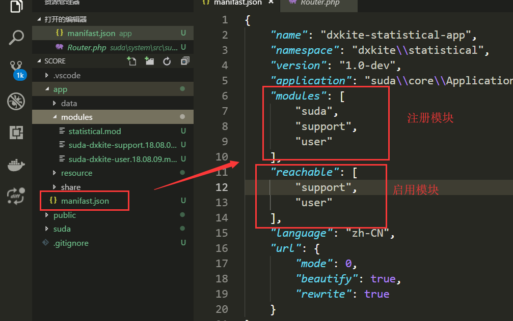
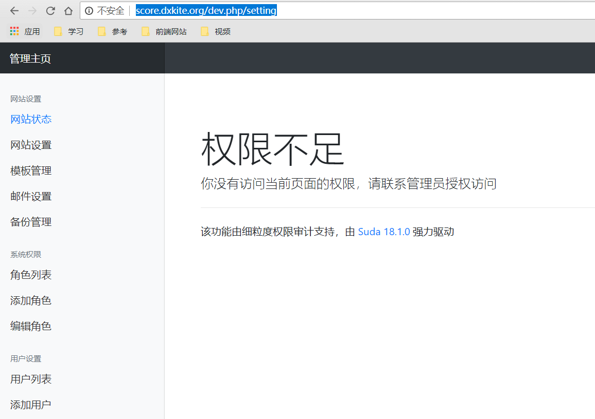
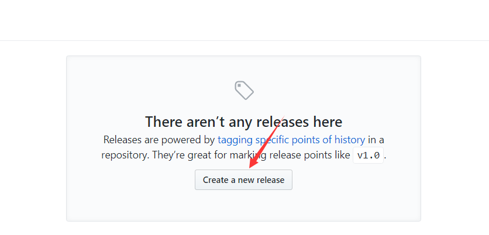
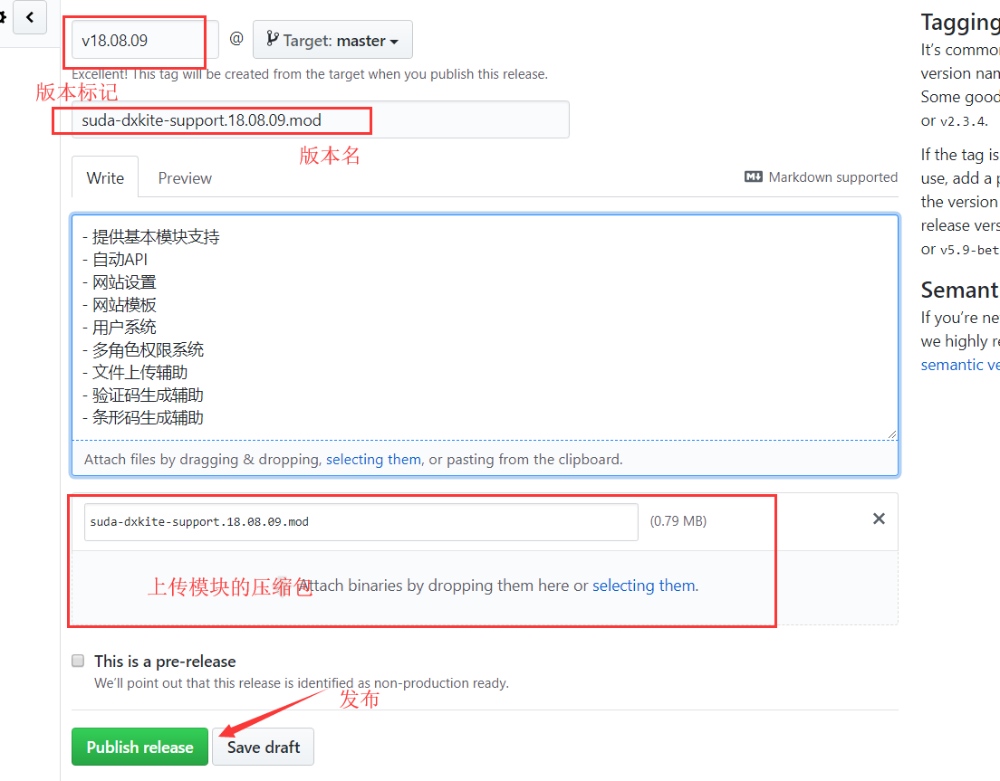
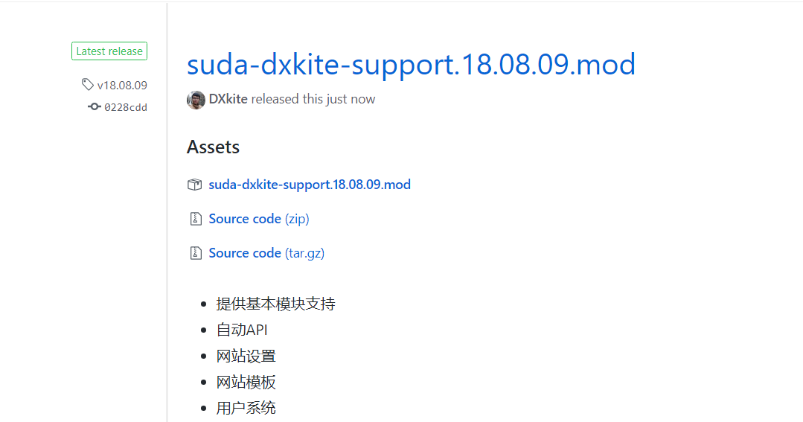

在Suda框架中，支持模块化编程，也就是功能可以作为一个个模块来加入或者使用，这里我们先学会做一个模块包吧！

<!-- more -->

## 创建模块包

在[Suda最新的版本更新](https://github.com/DXkite/suda/commit/9cd673b1ed76337fe9ef9b0685f77d2ba88471ed)中，支持模块以压缩包的形式发布

发布要求：

1. 完整的功能模块包
2. 没有父级文件夹

### 压缩文件

打开我们写好的成绩统计模块，对他使用ZIP进行压缩，压缩后，压缩包的结构如下：

### 重命名

将压缩包重命名为 `statistical.mod` 放置到模块目录下，现在的模块结构是这样的：

然后现在把 `statistical` 文件夹处理掉（删除或者保存到其他地方）,访问网站目录，可以看到网站依旧运行了

整个模块的代码会被解压到 `data/runtime/modules/模块文件名文件夹/` 下，没必要管他了：

如果运行失败，检擦一下框架的版本号和压缩包的内容是否正确。

## 引入其他模块

我们在开发的过程中，我们有些功能不想开发，然后刚刚好网上又有这个，就拿来用就好（PS：Suda模块中心应该提上日程了）

这里我们玩一下两个模块：

- 支持模块 
    
    提供文件，数据库，网站设置等基础功能的支持 [下载](suda-use-module/dxkite-support.18.08.10.mod)
- 用户模块

    提供用户的注册登陆等功能 [下载](suda-use-module/dxkite-user.18.08.10.mod)

下载完成后，放到模块文件夹下面，现在的文件夹结构：

我们先访问一下网站，没出错的话模块算是安装成功了。

## 启用模块

模块安装后，不启用是没法使用的（安全性考虑），所以，现在我们需要手动启用：编辑 `manifast.json` 文件：

- 注册模块：注册模块后，模块的 share 文件夹的代码和 resource 的资源都可以被使用
- 启用模块：启用模块后，模块可以通过浏览器访问

启用模块后，我们访问： host/dev.php/setting 应该可以看到如下页面，说明我们的模块安装成功

## 发布版本

在项目主页选择版本：

填写好版本信息，并上传模块打包后的包

发布成功后：

## 作业

- 打包自己的模块
- 安装两个模块测试
- 发布自己的模块